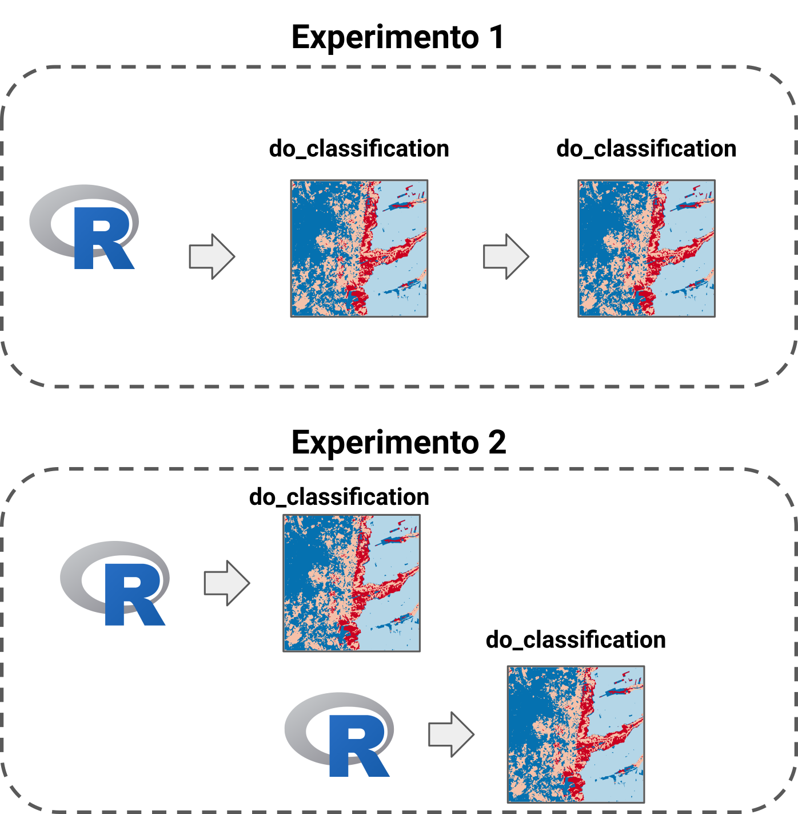
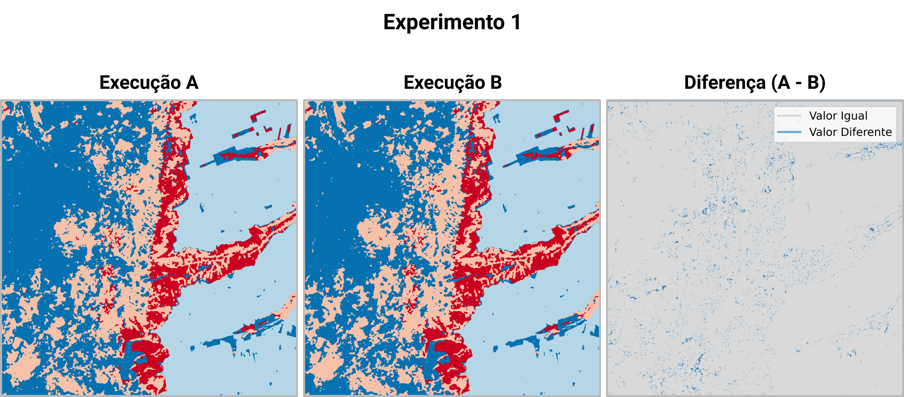
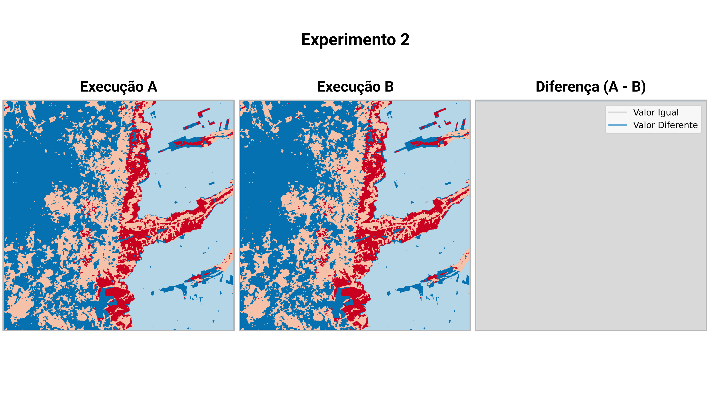

# Experimento - Ambientes de execução

Conjunto de experimentos para verificar os impactos causados pelo uso de ambientes "contaminados" na aplicação de algoritmos de Aprendizado de Máquina. Os testes foram feitos utilizando o pacote [R SITS](https://github.com/e-sensing/sits).

> Neste teste é feito o teste da influência do ambiente nos resultados. A nomenclatura de ambientes "contaminados" é descrita no artigo:
> Blischak JD, Carbonetto P, and Stephens M. Creating and sharing reproducible research code the workflowr way [version 1; peer review: 3 approved]. F1000Research 2019, 8:1749 (https://doi.org/10.12688/f1000research.20843.1)

## Descrição dos testes

Ambientes "contaminados" são aqueles terminais interativos utilizados pelos pesquisadores durante diversas horas que no final da operação gera os resultados que serão utilizados em um artigo ou relatório. O problema é que as várias mudanças nas variáveis, transformações e execuções podem gerar resultados não rastreados como funções "in-line" que geram um bom resultado mas não são documentadas. Outro problema está nas *seeds* aleatórias. Mesmo especificando, após várias mudanças, pode ser que o ciclo de execução não tenha como ser rastreadas, tornando o resultado impossível de ser reproduzido.

> *O correto é reiniciar o ambiente e fazer a execução novamente!*

Este conjunto de testes ilustra o problema citado anteriormente. Para isso, é considerada a atividade de geração de mapa de uso e cobertura da Terra (LULC, do inglês *Land Use and Land Cover*), através do uso de cubos de dados de imagens de satélite e o algoritmo de Aprendizado de Máquina `Random Forest`. Serão realizados dois experimentos. No primeiro deles é executada a classificação de uma mesma região, utilizando o mesmo código duas vezes. Ambas as classificações são feitas em um mesmo processo **R**, representando a execução uma única vez do *script* de classificação. Por outro lado, no segundo experimento são feitas as mesmas duas classificações, porém, utilizando processos **R** diferentes. Assim, o *script* de classificação é executado duas vezes.

Considerando que cada classificação é feita em um *script* por uma função nomeada de `do_classification`, a Figura 1 sumariza a forma com que cada teste será realizado.

<div align="center">
    <figure>
        <br>
        <figcaption><b>Figura 1.</b> Fluxo de operação das funções de classificação em cada experimento. </figcaption>
    </figure>
</div>

<br>

> O estilo utilizado para a geração de todas as figuras em que os mapas de classificação são apresentados, está disponível no arquivo <font color="#000099">estilo.qml</font>

Em resumo:

- **Experimento 1**: Neste experimento a execução é realizada considerando o mesmo processo do R. Assim, a função `do_classification` é chamada duas vezes na mesma sessão;

- **Experimento 2**: Neste experimento, a execução das classificações são realizadas em sessões do R diferentes. Utilizando o exato mesmo código do Experimento 1.

## Construção dos experimentos

> A execução depende do [Docker](https://www.docker.com/). Para fazer a instalação, utilize a [documentação oficial](https://docs.docker.com/engine/install/)

Para reproduzir os testes realizados, pode-se utilizar o `Makefile`. Para a construção do ambiente base, com todas as dependências do pacote SITS, faz-se o uso do comando abaixo:

```shell
make build
```

Após a construção do ambiente, os experimentos podem ser executados

*Experimento 1*
```shell
make experiment_01
```

*Experimento 2*
```shell
make experiment_02
```

## Geração das figuras de comparação

Para gerar as figuras de verificação dos resultados pode-se utilizar o comando:

```shell
make validation
```

> Após finalizar as execuções, você pode excluir os *Docker Containers* criados utilizando `make clean`.

As figuras de comparação são apresentadas abaixo. Como pode-se perceber, para o Experimento 01, o qual a classificação foi feita em um mesmo processo **R**, sem nenhuma reinicialização (Ambiente "contaminado"), tem-se diferenças nos resultados. Por outro lado, para o Experimento 02, onde os **scripts** de classificação foram executados desde o início, em processos **R** diferente, tem-se o mesmo resultado.

<div align="center">
    <figure>
        <br>
        <figcaption><b>Figura 2.</b> Comparação entre os resultados gerados no Experimento 01</figcaption>
    </figure>
</div>

<br><br>

<div align="center">
    <figure>
        <br>
        <figcaption><b>Figura 3.</b> Comparação entre os resultados gerados no Experimento 02</figcaption>
    </figure>
</div>

Assim, é possível entender a importância de seguir boas práticas ao gerar os resultados de uma pesquisa. Aqui, mesmo com o ambiente computacional, dados e código disponível, para o caso do Experimento 01, seria impossível a reprodução.
